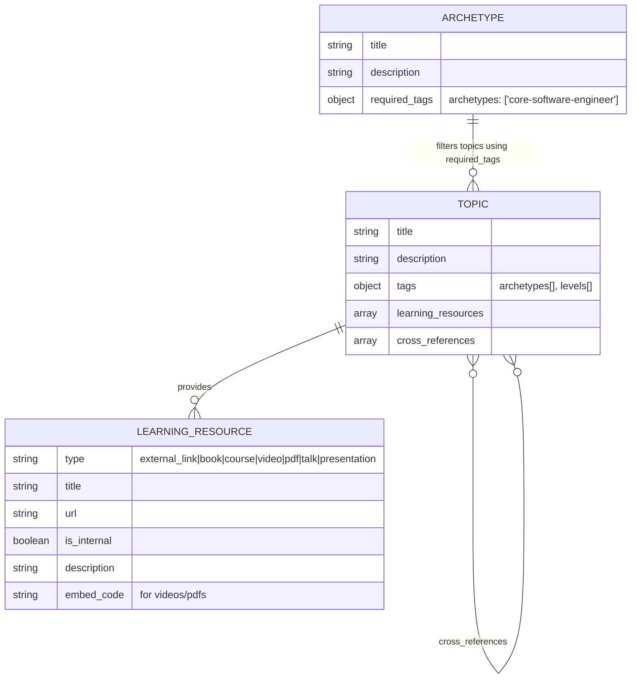

# Data Architecture

This document describes the data model for the Zühlke Archetypes project, which supports career pathway definitions and learning resources using YAML frontmatter embedded in markdown files.

## Overview

The data architecture defines the structure and relationships between archetypes, topics, learning resources, and cross-references.
In the updated design, archetypes no longer manually define skill stages. Instead, topics declare their own metadata, and archetypes select topics using `required_tags`.

Skill stages are now generated dynamically using MkDocs macros, based on topic-level metadata.

Data is stored as YAML frontmatter within markdown files and processed during the MkDocs build process.
For context on the decision to use frontmatter, see [ADR-0001](ADRs/ADR-0001.md).

## Entity Model



## Core Entities

### Archetype

Represents a career pathway or role specialization (e.g., "Core Software Engineer").

- **title**: Display name of the archetype
- **description**: Overview explaining the archetype's purpose and scope
- **required_tags**: Determines which topics appear in this archetype

Example:

```
required_tags:
  archetypes:
    - core-software-engineer
```

Note:
In the updated architecture, skill_stages is optional and no longer required.
Stages are generated dynamically based on topic tags.levels.

Example:

```
tags:
  archetypes:
    - core-software-engineer
  levels:
    - novice
    - competent
```

### Topic

Detailed learning content for a specific skill or concept (e.g., "Version Control Systems", "Test Driven Development").

- **title**: Display name of the topic
- **description**: Detailed explanation of the concept
- **learning_resources**: Array of learning materials
- **cross_references**: Links to related topics

### Learning Resource

Individual learning materials embedded directly within topics (not normalized as separate entities):

- **external_link**: Web resources and documentation
- **book**: Published books with bibliographic information
- **course**: Internal training courses (marked as internal)
- **video**: YouTube videos and talks (with embed code)
- **pdf**: Presentations and documents (with embed code)

**Important**: Learning resources are stored as arrays within topic files, not as separate referenced entities. This design choice prioritizes simplicity and contextual information over normalization.

## Relationships

1. **Archetype → Topics**: Topics are selected dynamically using `required_tags`.
2. **Topic → Learning Resources**: Topics embed their own learning resources.
3. **Topic → Topic**: Cross-references define related learning subjects.

**Note on Learning Resources**: Unlike other relationships, learning resources are embedded directly within topic files rather than being separate entities. This avoids normalization in favor of simplicity and contextual information.

Deprecated Relationship:
Archetype → Skill Stages → Topics
In the new architecture, skill stages are generated dynamically from topic metadata.

## Implementation Notes

### YAML Frontmatter Structure

Archetypes now declare which topics they include using required_tags:

```markdown
---
# YAML frontmatter contains structured data
title: Core Software Engineer
description: "A full-stack engineer able to deliver business value."

required_tags:
  archetypes:
    - core-software-engineer
---

# Markdown content follows

Description and rich content here...

{{ render_dynamic_skill_stages() }} # Macro uses frontmatter data
```

Topics declare their own metadata:

```
title: Test Driven Development (TDD)
tags:
  archetypes:
    - core-software-engineer
  levels:
    - competent
learning_resources:
  - type: "book"
    title: "Growing Object-Oriented Software, Guided by Tests"
cross_references:
  - "pair-programming"
```

### Topic Discovery

- Topics are discovered automatically from src/topics/\*\*.

- Filenames determine slugs.

- Tags define archetype membership and level grouping.

- No manual maintenance inside archetypes is required.

### Identifier System

- **Topics**: Use filename slug (e.g., version-control-systems)

- **Archetypes**: Use filename slug

- **Learning Resources**: Inline items; no separate identification

### Learning Resource Identification

Learning resources remain embedded within topics:

```yaml
---
# In topic frontmatter
learning_resources:
  - type: "external_link"
    title: "Learn Git Branching"
    url: "https://learngitbranching.js.org/"
    description: "Interactive Git branching tutorial"

  - type: "book"
    title: "Pro Git"
    author: "Scott Chacon"
    url: "https://git-scm.com/book"
    publisher: "Apress"
    year: 2014
---
# Markdown content
Description of version control systems...

{{ render_learning_resources() }} # Generates from frontmatter
```

### Cross-References

Topics can reference relevant related topics:

```
cross_references:
  - "test-driven-development"
  - "pair-programming"
```

Rendered with:

`{{ render_cross_references() }}`

**Rationale:**

- Learning resources are specific to each topic
- No need for separate files or cross-referencing
- Simpler data structure and maintenance
- Resources are contextual to their topic

**Optional Slugs:**
Learning resources can optionally include slugs for advanced use cases (e.g., tracking completion, analytics):

```yaml
learning_resources:
  - slug: "learn-git-branching" # optional
    type: "external_link"
    title: "Learn Git Branching"
```

### Learning Resource Types

Learning resources are classified by type to enable appropriate rendering:

- **external_link**: Simple web links
- **book**: Include bibliographic information (author, publisher, year)
- **course**: Internal training materials (marked with access restrictions)
- **video**: YouTube videos and talks (include embed codes)
- **pdf**: Presentations and documents (include embed codes)

### Cross-References

Topics can reference related topics using the same slug-based system to create learning pathways and show conceptual relationships.

Example:

```yaml
---
# In extreme-programming-practices.md frontmatter
cross_references:
  - "test-driven-development"
  - "pair-programming"
  - "version-control-systems"
---
# Markdown content
Description of XP practices...

{{ render_cross_references() }} # Generates from frontmatter
```

### Build Process

1. **MkDocs reads** markdown files with YAML frontmatter
2. **Frontmatter extracted** automatically (available as `page.meta`)
3. **Macro plugin processes** `{{ macro_calls() }}` using frontmatter data
4. **JSON Schema validation** ensures frontmatter structure is correct
5. **Standard MkDocs build** generates static site

### Build Process

1. **MkDocs reads** reads the markdown files.

2. **Frontmatter extracted** is extracted and passed to macros.

3. **All topics** are loaded from the filesystem.

4. **Topics** are filtered using archetype required_tags.

5. **Levels** are assigned using tags.levels.

6. **Dynamic UI** is rendered (Mermaid diagram + `<details>` blocks).

7. **JSON Schema** validation ensures a correct structure.

8. **Static** site is generated.

## Why This Approach Is Better

The previous approach relied on archetype maintainers manually maintaining lists of topics and skill stages, which caused:

- duplicated topics

- inconsistent content

- fragmented learning paths

- maintenance overhead

- difficulty ensuring shared standards

### Advantages of the new tag-based model:

- Single source of truth: Each topic is defined once.

- Automatic propagation: Changes apply to all archetypes using that topic.

- No duplication: Topics like TDD exist in a single canonical form.

- Shared learning standards: All archetypes refer to the same definitions.

- Lower maintenance: Archetype maintainers no longer manage long lists.

- Cleaner navigation: Prevents Confluence-style sprawl from duplicate content.

- Future-proof: Knowledge remains even if maintainers change roles.

If multiple archetypes use a topic (like TDD), they now share one consistent version instead of creating and maintaining duplicates.
