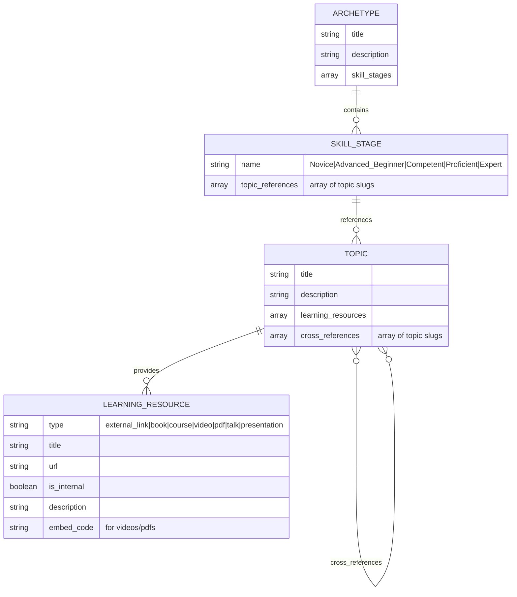

# Data Architecture

This document describes the data model for the Zühlke Archetypes project, which supports career pathway definitions and learning resources using YAML frontmatter embedded in markdown files.

## Overview

The data architecture defines the structure and relationships between archetypes, skill stages, topics, and learning resources. Data is stored as YAML frontmatter within existing markdown files, processed by MkDocs macros during build. For context on the decision to use frontmatter, see [ADR-0001](ADRs/ADR-0001.md).

## Entity Model



## Core Entities

### Archetype
Represents a career pathway or role specialization (e.g., "Core Software Engineer").

- **title**: Display name of the archetype
- **description**: Overview explaining the archetype's purpose and scope
- **skill_stages**: Array of Dreyfus model stages containing topics

### Skill Stage
Represents one of the five Dreyfus model stages of skill acquisition:
- Novice
- Advanced Beginner
- Competent
- Proficient
- Expert

Each stage contains references to topics that should be mastered at that level.

### Topic
Detailed learning content for a specific skill or concept (e.g., "Version Control Systems", "Test Driven Development").

- **title**: Display name of the topic
- **description**: Detailed explanation of the concept
- **learning_resources**: Array of learning materials
- **cross_references**: Links to related topics

### Learning Resource
Individual learning materials embedded directly within topics (not normalized as separate entities):

- **external_link**: Web resources and documentation
- **book**: Published books with bibliographic information
- **course**: Internal training courses (marked as internal)
- **video**: YouTube videos and talks (with embed code)
- **pdf**: Presentations and documents (with embed code)

**Important**: Learning resources are stored as arrays within topic files, not as separate referenced entities. This design choice prioritizes simplicity and contextual information over normalization.

## Relationships

1. **Archetype → Skill Stages**: Each archetype defines progression through Dreyfus stages
2. **Skill Stage → Topics**: Each stage references specific topics to master
3. **Topic → Learning Resources**: Topics contain embedded learning materials (not referenced)
4. **Topic → Topic**: Cross-references between related concepts

**Note on Learning Resources**: Unlike other relationships, learning resources are embedded directly within topic files rather than being separate entities. This avoids normalization in favor of simplicity and contextual information.

## Implementation Notes

### YAML Frontmatter Structure
Data is stored as YAML frontmatter at the top of markdown files:

```markdown
---
# YAML frontmatter contains structured data
skill_stages:
  - name: "Novice"
    topics: ["version-control-systems", "html-css-basics"]
---

# Markdown content follows
Description and rich content here...

{{ render_skill_stages() }}  # Macro uses frontmatter data
```

### Topic References
- Each skill stage contains an array of topic references using **URL slugs**
- Example: `"version-control-systems"` references `/topics/version-control-systems.md`
- Slugs are derived from topic titles: lowercase, spaces → hyphens, special chars removed
- Topic references map directly to file paths and URL structure
- Missing topic pages will result in 404 errors until content is created

### Identifier System
All entities use slug-based identifiers for cross-referencing:
- **Topics**: Use filename slug (e.g., `version-control-systems`)
- **Archetypes**: Use filename slug (e.g., `core-software-engineer`)
- **Learning Resources**: Can optionally have slugs for cross-referencing between topics

### Learning Resource Identification
Learning resources are **embedded within topic frontmatter** rather than being separate referenced entities:

```yaml
---
# In topic frontmatter
learning_resources:
  - type: "external_link"
    title: "Learn Git Branching"
    url: "https://learngitbranching.js.org/"
    description: "Interactive tutorial for learning Git"
  
  - type: "book"
    title: "Pro Git"
    author: "Scott Chacon"
    url: "https://git-scm.com/book"
    publisher: "Apress"
    year: 2014
---

# Markdown content
Description of version control systems...

{{ render_learning_resources() }}  # Generates from frontmatter
```

**Rationale:**
- Learning resources are specific to each topic
- No need for separate files or cross-referencing
- Simpler data structure and maintenance
- Resources are contextual to their topic

**Optional Slugs:**
Learning resources can optionally include slugs for advanced use cases (e.g., tracking completion, analytics):
```yaml
learning_resources:
  - slug: "learn-git-branching"  # optional
    type: "external_link"
    title: "Learn Git Branching"
```

### Learning Resource Types
Learning resources are classified by type to enable appropriate rendering:
- **external_link**: Simple web links
- **book**: Include bibliographic information (author, publisher, year)
- **course**: Internal training materials (marked with access restrictions)
- **video**: YouTube videos and talks (include embed codes)
- **pdf**: Presentations and documents (include embed codes)

### Cross-References
Topics can reference related topics using the same slug-based system to create learning pathways and show conceptual relationships.

Example:
```yaml
---
# In extreme-programming-practices.md frontmatter
cross_references:
  - "test-driven-development"
  - "pair-programming"
  - "version-control-systems"
---

# Markdown content
Description of XP practices...

{{ render_cross_references() }}  # Generates from frontmatter
```

### Build Process
1. **MkDocs reads** markdown files with YAML frontmatter
2. **Frontmatter extracted** automatically (available as `page.meta`)
3. **Macro plugin processes** `{{ macro_calls() }}` using frontmatter data
4. **JSON Schema validation** ensures frontmatter structure is correct
5. **Standard MkDocs build** generates static site